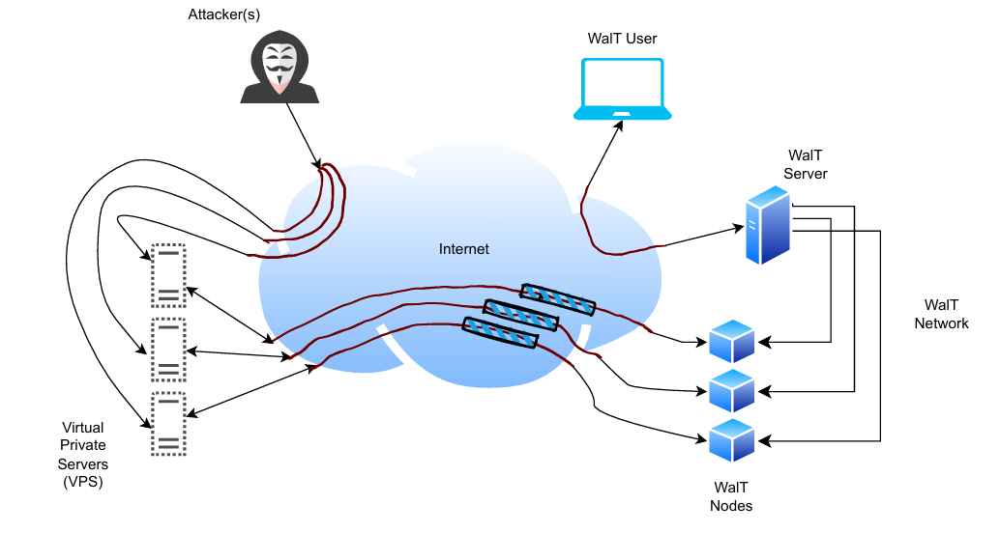

# WalT Honeypot System

This project is a distributed SSH honeypot architecture that uses WalT for handling the network testbed and Cowrie for capturing attacks. 

- WalT is a platform and tool used to build experimental network testbeds and manage node OS images for research and testing. See [WalT Documentation](https://walt.readthedocs.io/en/latest/) for more information.

- Cowrie is an open-source tool used for catching and logging SSH/Telnet attacks. It captures credentials, commands, malware and so on. More information can be found in [Cowrie Documentation](https://docs.cowrie.org/en/latest/).

- This project also uses WireGuard for VPN tunneling, which will be mentioned in the upcoming sections. Check [WireGuard website](https://www.wireguard.com) for more information.

## Table of Contents

- [Architecture](#architecture)
- [Using the Scripts](#using-the-scripts)
  - [Updating Variables](#updating-variables)
  - [Creating the WalT Image](#creating-the-walt-image)
  - [Establishing a WireGuard Connection](#establishing-a-wireguard-connection)
  - [Establishing Firewall Rules](#establishing-firewall-rules)
- [Monitoring and The Dashboard](#monitoring-and-the-dashboard)

## Architecture

The system employs three distinct Virtual Private Servers (VPS) located in three different regions to act as the public entrypoint for the honeypot network. These VPS instances are linked to three private nodes via WireGuard tunnels. These nodes are WalT nodes, managed by a single WalT server. WalT server manages the images and the boot processes for all physical nodes. Rebooting nodes end up wiping the node. Any change outside of the `/persist` folder does not survive reboot processes. If something needs to survive a reboot, it either needs to be part of the image that is used for the boot or it should be inside the `/persist` folder of the nodes.

VPS instances use `iptables` rules to redirect incoming SSH connections (port 22) through the WireGuard tunnel to the Cowrie service running on each node. Nodes are configured with firewall rules to accept the tunneled traffic and respond with Cowrie's fake SSH interface through the WireGuard tunnel while keeping the original attacker IPs. By design nodes are only open to public for establishing a WireGuard tunnel with their corresponding VPS instances. 



## Using the Scripts

You can boot WalT nodes with one single image. The image script provided in this repo, `image.sh` can be used to reproduce this experiment in your own environment.

### Updating Variables
At the start of the script, a shared variables file is created. Here you need to update these variables with your information:

- **INTERFACE:** This is the name of the interface the WalT nodes use for establishing a WireGuard tunnel. This interface is going to be assigned the public IP of your nodes.
- **IP_ADDRESS1:** This is the **first** public IP address that will be assigned to one of your nodes' public-facing interface.
- **IP_ADDRESS2:** This is the **second** public IP address that will be assigned to one of your nodes' public-facing interface.
- **IP_ADDRESS3:** This is the **third** public IP address that will be assigned to one of your nodes' public-facing interface. I have three nodes and therefore three IP addresses but this list can be extended. However, the scripts might need a little change if you need more than 3 nodes.
- **NODE1_MAC:** This is the MAC address of the **first** node's public-facing interface. Which is the INTERFACE variable we mentioned.
- **NODE2_MAC:** This is the MAC address of the **second** node's public-facing interface.
- **NODE3_MAC:** This is the MAC address of the **third** node's public-facing interface. These MAC addresses are used for network configuration and generating WireGuard config files. The script matches IP addresses to MAC addresses and that's why the script needs to be extended to include more lines if we are dealing with more than three devices.
- **GATEWAY:** This the gateway address of the public IP addresses of your WalT nodes.
- **VPS_INTERFACE:** This is the name of the public-facing interface of the VPS instances. This might be different for your VPS instances but this variable is only used inside VPS routing script and it can be easily changed. More details will be given later on in this document.
- **WG_PORT:** This is the port used for establishing a WireGuard tunnel on your nodes.
- **GOOFY_VPS_PUBLICKEY:** This is the public key you generate on your **first** VPS instance for WireGuard tunneling. WireGuard public and private keys can be generated with the command `wg genkey | tee /etc/wireguard/privatekey | wg pubkey > /etc/wireguard/publickey`. Goofy, Pluto and Mickey are only the nicknames of our nodes. 
- **PLUTO_VPS_PUBLICKEY:** This is the public key you generate on your **second** VPS instance for WireGuard tunneling. 
- **MICKEY_VPS_PUBLICKEY:** This is the public key you generate on your **third** VPS instance for WireGuard tunneling.

If you will use more than three devices, `network.sh` and `wireguard.sh` that are created inside `image.sh` need to be changed. Since we are booting three different nodes with the same image, `network.sh` will first get the device's MAC address and try to match it to ones that we specified on the list and assign an IP address based on it, after the device is booted with the image. In this way we can use a single image to assign three different IP addresses to three different nodes.
```python
# Assign Public IP based on the MAC address of the node
if [ "$NODE_MAC" == "$NODE1_MAC" ]; then
    ip addr add $IP_ADDRESS1 dev $INTERFACE || true
    ip link set $INTERFACE up
    ip route add $GATEWAY dev $INTERFACE || true
    ip route add 0.0.0.0/0 via $GATEWAY dev $INTERFACE
elif [ "$NODE_MAC" == "$NODE2_MAC" ]; then
    ip addr add $IP_ADDRESS2 dev $INTERFACE || true
    ip link set $INTERFACE up
    ip route add $GATEWAY dev $INTERFACE || true
    ip route add 0.0.0.0/0 via $GATEWAY dev $INTERFACE
elif [ "$NODE_MAC" == "$NODE3_MAC" ]; then
    ip addr add $IP_ADDRESS3 dev $INTERFACE || true
    ip link set $INTERFACE up
    ip route add $GATEWAY dev $INTERFACE || true
    ip route add 0.0.0.0/0 via $GATEWAY dev $INTERFACE
else
    echo "MAC address $NODE_MAC did not match any known nodes."
fi
```
`wireguard.sh` follows a similar logic by checking the device's MAC for generating the `wg0.conf` that we will need to use on the corresponding VPS instances for all the nodes.
```python
if [ "$NODE_MAC" == "$NODE1_MAC" ]; then
    VPS_PUBLICKEY=$GOOFY_VPS_PUBLICKEY
    NODE_PUBLIC_IP=${IP_ADDRESS1%%/*}
elif [ "$NODE_MAC" == "$NODE2_MAC" ]; then
    VPS_PUBLICKEY=$PLUTO_VPS_PUBLICKEY
    NODE_PUBLIC_IP=${IP_ADDRESS2%%/*}
elif [ "$NODE_MAC" == "$NODE3_MAC" ]; then
    VPS_PUBLICKEY=$MICKEY_VPS_PUBLICKEY
    NODE_PUBLIC_IP=${IP_ADDRESS3%%/*}
else
    echo "MAC address $NODE_MAC did not match any known nodes."
    exit 1
fi
```
After updating the variables, the image script `image.sh` handles the rest of it.

### Creating the WalT Image
When first booting WalT nodes, they boot with their default image. It is possible to build onto that image and save our changes as a separate image.

1. Start a shell session inside the default image (e.g. rpi-default):
```bash
walt image shell rpi-default
```

2. Create image.sh and paste the contents. Since we want to keep the image as light as possible, I did not download `nano` into the image to handle files and instead used the built-in vi editor, but you can download `nano` if you choose to:
   1. `vi image.sh` : Open vi editor
   2. `:set paste` : Enable paste mode
   3. `i` : Enter insert mode
   4. `Shift + Insert` : Paste the script contents from clipboard
   5. `Esc` : Exit insert mode
   6. `:wq` : Save and quit vi

3. Make image.sh executable:
```bash
chmod +x image.sh
```

4. Run the script:
```bash
./image.sh
```

5. After running the script you can quit the shell by typing `exit` and WalT will display a prompt for you to either enter a new image name, enter the same name to override the existing image or press Ctrl + C to ignore all changes. Here we can give the image a name of our choosing and save this image as a separate image to use it later on to boot our nodes. To boot nodes, we need to specify the node names and the image name in the below format with nodes named **goofy**, **pluto** and **mickey**, and the image named as **new-image** as an example:
```bash
walt node boot goofy,pluto,mickey new-image
```

### Establishing a WireGuard Connection

The image creates a folder named **vps-configs**. In this folder, there is a `wg0.conf` file intended for the VPS instance of the node. 
1. First, on the VPS instances, we need to generate a public key and a private key:
```bash
wg genkey | tee /etc/wireguard/privatekey | wg pubkey > /etc/wireguard/publickey
```
2. We will paste the private key of the VPS to the configuration below. This file is the file created under the **vps-configs** folder and private key is the only thing we need to specify here. Rest is handled by the image. After modifying this `wg0.conf` file, place it in the `etc/wireguard/` directory on the VPS instance.
> Note: This requires root access; use `sudo su -` to elevate on the VPS.
```ini
[Interface]
Address = 10.10.10.2/24
PrivateKey = <VPS_PRIVATE_KEY>
Table = off

[Peer]
PublicKey = $NODE_PUBLIC_KEY
Endpoint = $NODE_PUBLIC_IP:$WG_PORT
AllowedIPs = 10.10.10.0/24, 10.10.10.1/32
PersistentKeepalive = 25
```
3. Finally, to get the WireGuard interface up and running, run the below command **first** on the **node**, then on the VPS (with root access):
```bash
wg-quick up wg0
```
4. You can test the connection by pinging the node and/or the VPS from the other device:
```bash
ping 10.10.10.1
```

### Establishing Firewall Rules
> Before proceeding, you should change the SSH port of the VPS instances so that you have a way of making an SSH connection while Cowrie logs traffic that reaches the default SSH port (Port 22).

As part of the image, two scripts are created under the `/usr/local/bin/` folder of the node: `node-routing.sh` and `vps-routing.sh`.

1. `vps-routing.sh` is created for you to conveniently copy and run on the VPS. This is the script that requires the name of the public-facing interface of the VPS. As mentioned before, this variable is handled as part of the `vars.conf` file that the image script uses, however all VPS instances might not have the same name for their interface. In that case, we can simply declare the variable at the top of `vps-routing.sh` script:

```bash
echo "Configuring VPS Routing..."
source /etc/vars.conf

VPS_INTERFACE="ens4" # The public-facing network interface on the VPS (e.g., eth0, ens4, enp0s3, etc.)
```
> Note: The `vars.conf` is only loaded to get the VPS_INTERFACE variable. We can override it like the above example or we can simply delete that line.

2. After making sure the `vps-routing.sh` has the right interface name, first make the script executable:
```bash
chmod +x vps-routing.sh
```

3. Then run the script (as root):
```bash
./vps-routing.sh
```

4. Then run the routing script for the nodes, on the nodes. It is already made executable by the image so we just need to run it:
```bash
/usr/local/bin/node-routing.sh
```

## Monitoring and The Dashboard
At this point, the honeypot is up and running. You can see for yourself by trying to SSH into the VPS itself. The logs of that will also be visible from the WalT server since our image sends Cowrie logs to WalT's own monitoring system.

To see realtime attacks as they happen from a specific node (delete the `--issuers <NODE_NAME>` part to see the data on every node):
```bash
walt log show --issuers pluto --realtime --streams "cowrie-attacks"
```
To see logs from a specific time ago until now (-1d for one day, -1h for one hour, -1m for one minute and -1s for one second and so on):
```bash
walt log show --issuers mickey --history -1d: --streams "cowrie-attacks"
```
To see logs from a specific time ago until now while also printing realtime attacks:
```bash
walt log show --issuers goofy --history -1d: --realtime --streams "cowrie-attacks"
```

It is possible to see these logs from the command line as specified above, however the data is big and it is basically impossible to go over them one by one. Therefore, there is a dashboard for better analysis. To be able to use the dashboard, we need to build the database first. The information about the database can be found inside the [logs folder](/logs/README.md).

1. To be able to run the dashboard, first download streamlit and pandas:
```bash
pip install streamlit pandas
```

2. In `dashboard.py`, make sure you have the right path for your database file:
```python
DB_FILE = "logs\\honeypot.db"
```

3. Run `dashboard.py`:
```bash
streamlit run dashboard.py
```

The dashboard is a Streamlit-based web interface that provides analysis across six tabs: 
- **Overview & Traffic** displays metrics (total events, unique attacker IPs) and charts showing top attackers and event distributions.
- **Key Credentials** ranks the most frequently attempted usernames, passwords, and combinations with global search and field-by-field filtering.
- **Malware & Commands** tracks file transfers grouped by SHA-256 hash, logs every terminal command executed by attackers, and integrates VirusTotal API to search if a malware is a known malware, and if it is, what type of malware it is.
- **Proxy & Tunneling** logs when attackers attempt to bounce traffic through the honeypot to access external targets.
- **Catch-All Event Explorer** unpacks raw Cowrie JSON payloads for any event type for analysis. 
- **Attacker Timeline** reconstructs complete chronological attack sessions by session ID, showing every action an attacker took. 
- All tabs support multi-node filtering via the sidebar, allowing you to compare attack patterns across nodes.